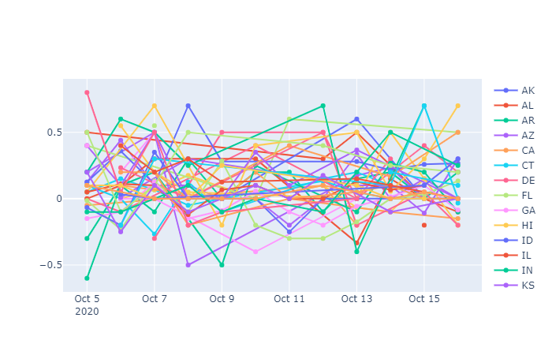
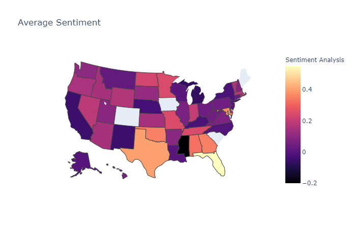

# twitter_nlp
Captures tweets from governors of all the US states and shows sentiment towards the Covid Pandemic during the selected dates, displays average sentiment during that time in map as well as average sentiment each day on a lineplot.

# required installs
```
pip install pandas plotly chart_studio numpy matplotlib tkcalendar requests TwitterAPI xlrd openpyxl
```

tkinter is a library included in python so no need to install it

# User Stories
* As a sociologist I want to see what is the average sentiment of governors regarding COVID.
* As a citizen I want to know if the information broadcasted by governors has any emotionally charged language.
* As a citizen I want to know if my governor is overly possitive or overly negative regarding the pandemic, by checking other governors tweets around the same time.
* As a researcher I want to know the state of the pandemic in each state and the response of the governors during certain time.
* As a healthcare professional I want to know how communicative the governor in each state is regarding the state of the pandemic.
* As a healtchare professional I want to know the governor's sentiment about the pandemic.

# required licences
need google cloud sdk key named "key" in the main folder as well as twitter API premium sandbox bearer key and app environment name (either 30 day or full_archive)

For the program to work replace *"credentials_template.py"* data with required keys and rename to *"credentials.py"*

Run program by running: 

```
python stateanalyzer.py
```

Depending on the type of license you might need to adjust the dev field in **credentials.py** to either *"30day"* or *"fullarchive"*, full archive has less pull requests but it grants access to historical data meanwhile 30 is limited to the previous 30 days but you get many more requests. Program might not run to completion since TwitterAPI limits the amount of requests per minute. Graphs are displayed in browser using plotly and are interactive.
# Flow

tkinter UI
|
v
open governors.csv file 
|
v
TwitterAPI with key words, dates and governors handle 
|
v
Google NLP 
|
v
Write tweets to csv 
|
v
Plotly Map, Plotly Graph (averages using Pandas)

# Testing

For the means of testing a button called *"tester"* has been added to analyze sentiment in October, this would not need API keys or any credentials. Raw data is located in the data_folder, the test button will appear on the GUI of stateanalyzer.py.

For testing each different function of stateanalyzer a different file called *test_twitter_nlp.py* has been added to the repository.


# MVP
This app should retrieve tweets from governors on all 50 states and plot the average sentiment into a map.

# Example Output from Test




